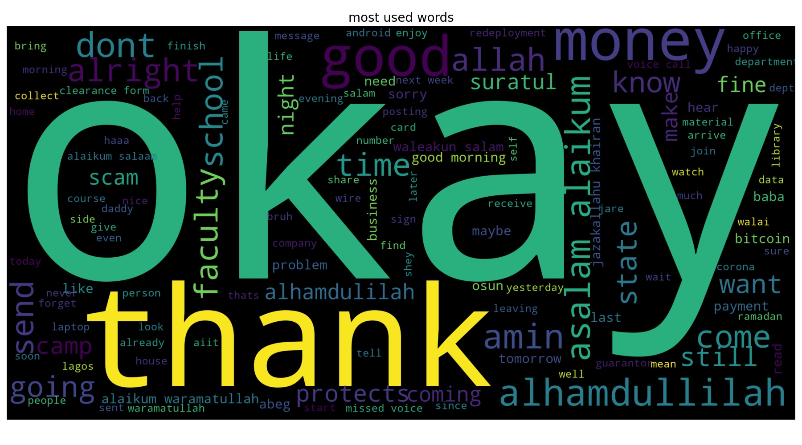

# Intermediate-DS-Projects
I went on a 5 days sprint of completing some of my previously started projects and i was able to deploy two (2).

I built a Whatsapp chat Analysis tool that enables whatsapp users to upload their whatsapp chat with their contacts and get some insights into how many messages is sent by them, how many message per day and message per month. currently hosted on Heroku. <a href="https://www.whatsapp-chat-analysis.heroku.com">here</a>

Performed analysis on click through rate for a retail Business

During the 5 days Sprint,
* I utilized and tested the concept of OOP in my codebase (Used Functions and classes alot in the code)
* Used Code Refactoring to reduce latency as well as codebase size
* Practice Model Deployment and Monitoring uisng PAAS **(Heroku, Streamlit)**

