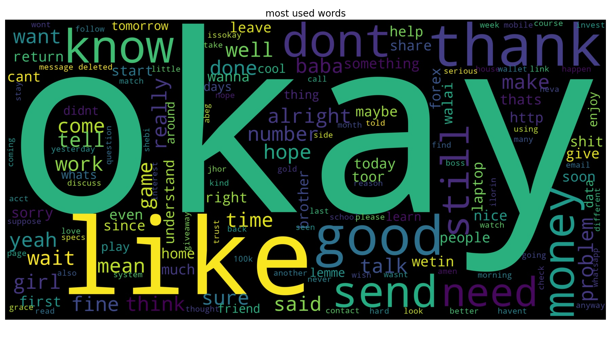

# Intermediate-DS-Projects
I went on a 5 days sprint of completing some of my previously started projects and i was able to deploy two (2).

I built a Whatsapp chat Analysis tool that enables whatsapp users to upload their whatsapp chat with their contacts and get some insights into how many messages is sent by them, how many message per day and message per month. currently hosted on Heroku. <a href="https://www.whatsapp-chat-analysis.heroku.com">here</a>

performed analysis on click through rate:: data gotten from kaggle

During the 5 days Sprint,
* i master the art of using OOP in my code (Used Functions and classes alot in the code)
* Used Code Refactoring to reduce latency
* Practice Model Deployment and Monitoring

do check it out and let me know i can improve thank you
